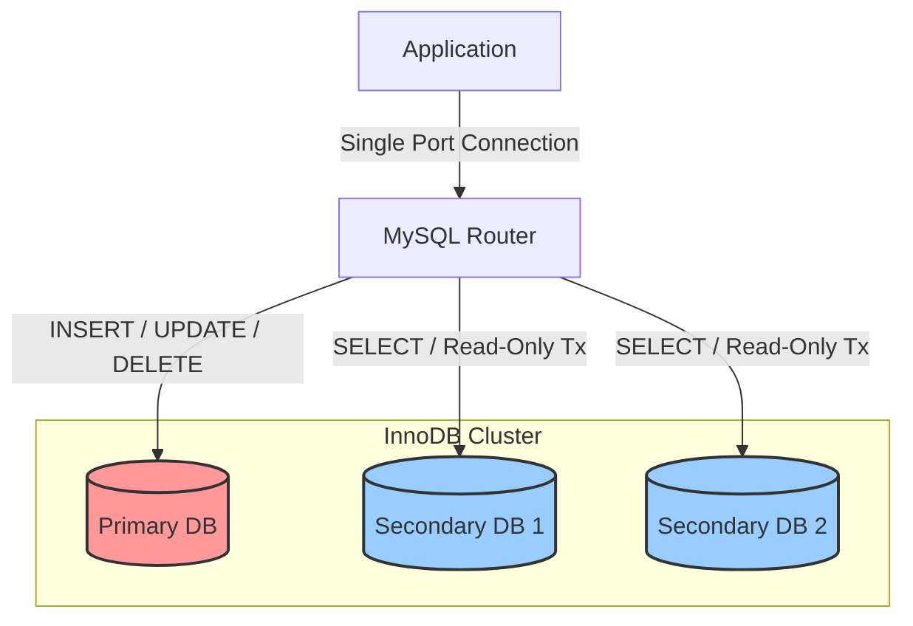

## MySQL Router의 Auto split 포트 : 똑똑한 트래픽 분산 (MySQL 8.4 기준)

과거에는 애플리케이션 코드 레벨에서 두 개의 커넥션 풀(RW용, RO용)을 관리하며 직접 분기 처리를 해야 했습니다. 하지만 MySQL Router의 기능을 잘 활용하면 이 복잡한 과정을 미들웨어단에서 간단하게 해결할 수 있습니다. MySQL Router가 InnoDB Cluster를 Auto Split(자동 분산) 포트를 이용해서 동작하는 기능에 대한 테스트 코드를 파이썬으로 생성하고 테스트했습니다. README.md와 함께 제공되는 auto_split_test.py 을 참고하시면 됩니다.
**각 환경에 맞게 DB 정보는 수정해서 사용하셔야 합니다.**  
이 글은 **InnoDB Cluster** 환경에서 **MySQL Router**의 역할과,  **Auto Split(Read-Write Splitting)** 기능에 대해 간략히 설명합니다.

---

## 개요 (Overview)

고가용성(HA) 데이터베이스 환경인 InnoDB Cluster를 구축한 후, 애플리케이션과 DB 간의 연결을 효율적으로 관리하기 위해 **MySQL Router**가 사용됩니다. 특히 **Auto Split** 기능을 활용하면 애플리케이션 코드 수정 없이도 트래픽 성격(Read/Write)에 따라 적절한 DB 노드로 쿼리를 분산시킬 수 있습니다.

---

## InnoDB Cluster에서 MySQL Router의 역할

MySQL Router는 애플리케이션과 InnoDB Cluster 노드들 사이의 **경량의 투명한 미들웨어**로 동작합니다.

* **Failover 자동화:** Primary 노드 장애 시, 새로운 Primary로 트래픽을 자동 전환합니다. (Metadata Cache 활용)
* **로드 밸런싱 (Load Balancing):** 여러 Secondary 노드에 읽기 부하를 분산합니다 
* **토폴로지 은닉:** 애플리케이션은 실제 DB 서버의 IP 변경을 알 필요가 없습니다. 장애 시 이 부분이 괭장히 중요합니다.  Primary 노드 장애 시 새로운 Primary 노드  IP 를 애플리케이션에서 몰라도 되기 때문입니다.

---

## Auto Split (자동 분산)이란?

기존의 방식은 포트를 두 개(R/W 포트, R/O 포트)로 나누어 애플리케이션에서 각각 연결해야 했습니다.
**Auto Split** (혹은 SQL-aware routing) 기능은 **하나의 포트**로 들어온 트래픽을 분석하여 자동으로 라우팅합니다.

* **작동 방식:**
1. 애플리케이션이 Router의 단일 포트로 접속
2. Router가 패킷/트랜잭션 모드를 분석
3. `RO(Read Only)` 트랜잭션 → **Secondary Node**로 라우팅
4. `RW(Read Write)` 트랜잭션 → **Primary Node**로 라우팅


---

## 아키텍처 다이어그램




---

## 설정 예시 (Configuration)


```
# mysqlrouter.conf 예시

[routing:bootstrap_rw_split]
bind_address = 0.0.0.0
bind_port = 6450
destinations = metadata-cache://my_cluster/default
routing_strategy = round-robin
protocol = classic
# R/W 스플리팅 관련 모드 설정 (버전별 상이할 수 있음)
# access_mode = auto 

```

> **Note:** 실제 설정은 MySQL Router 부트스트랩 시 생성되는 기본 설정을 따르거나, 버전에 맞는 옵션을 확인해야 합니다.

---

 ## 장단점 분석 (Pros & Cons)

Auto Split 기능을 도입하기 전 고려해야 할 사항들입니다.

| 구분 | 내용 |
| :--- | :--- |
| **장점 (Pros)** | • **개발 편의성:** 앱 소스코드에서 RW/RO 커넥션을 분리할 필요가 없음<br>• **마이그레이션 용이:** 레거시 시스템을 클러스터 환경으로 옮길 때 코드 수정 최소화<br>• **단일 엔드포인트:** 관리 포인트가 단순해짐 |
| **단점 (Cons)** | • **성능 오버헤드:** Router가 패킷을 파싱해야 하므로 단순 포워딩보다 CPU 사용량 증가<br>• **판단의 한계:** 복잡한 쿼리나 특정 세션 변수 상황에서 완벽한 분기가 어려울 수 있음<br>• **트랜잭션 일관성:** 읽기 직후 쓰기 등 트랜잭션 내의 정교한 제어가 필요한 경우 주의 필요 |

---

## 결론

MySQL Router의 **Auto Split**은 개발 복잡도를 낮추고 인프라 유연성을 높여주는 강력한 기능입니다. 하지만 고성능이 요구되거나 트랜잭션 제어가 매우 중요한 서비스에서는 기존의 **포트 분리 방식(Port Separation)**을 고려하는 것이 좋습니다.


---
